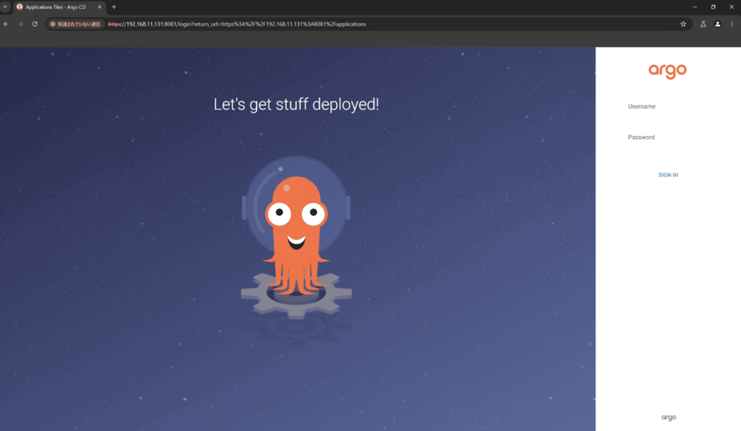

# kubernetes 1.30 on nobel

## Usage

- haproxy と keepalived の設定ファイルの Jinja テンプレートを生成する

```bash
$ cd ./files/lb/config_gen && \
  python -m venv .venv && \
  source .venv/bin/activate && \
  pip install -r requirements.txt && \
  python haproxy.py && \
  python keepalived.py
```

- vars_files 配下の変数を適宜修正。

- 事前に `create_cluster.sh` , `destroy_cluster.sh` を物理ノードのホームディレクトリに配置しておく

- 変数は適宜修正。

```bash
$ ./recreate-k8s.sh
```

### After running recreate-k8s.sh.

- Login to argocd deployed as a sample

```bash
kubectl apply -f - <<EOF
apiVersion: v1
kind: Service
metadata:
  name: argocd-lb
  namespace: argocd
spec:
  type: NodePort
  ports:
    - port: 443
      targetPort: server
      nodePort: 30001
      protocol: TCP
  selector:
    app.kubernetes.io/instance: argocd
    app.kubernetes.io/name: argocd-server
EOF
```

- Login

  > `https://192.168.11.161`

  > admin:admin

  

## Env

- Ubuntu 24.04
- kubernetes 1.30
- Containerd
- Cilium 1.16.1
- KVM
- Haproxy + Keepalived

## Host

| hostname | IP             |
| -------- | -------------- |
| k8s-api  | 192.168.11.131 |
| k8s-lb-1 | 192.168.11.131 |
| k8s-lb-2 | 192.168.11.132 |
| k8s-cp-1 | 192.168.11.141 |
| k8s-cp-2 | 192.168.11.142 |
| k8s-cp-3 | 192.168.11.143 |
| k8s-wk-1 | 192.168.11.151 |
| k8s-wk-2 | 192.168.11.152 |
| k8s-wk-3 | 192.168.11.153 |
| argocd   | 192.168.11.161 |

## Time of recreate_cluster

Execution time: 464 seconds
